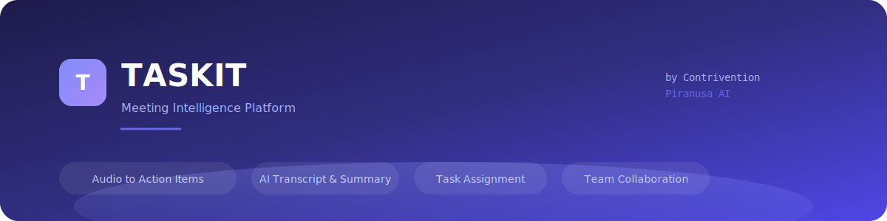
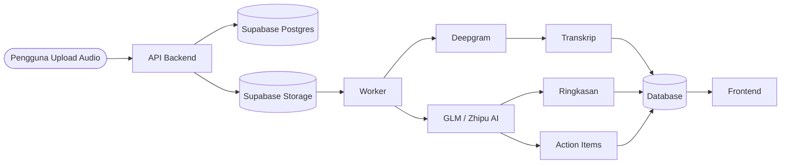
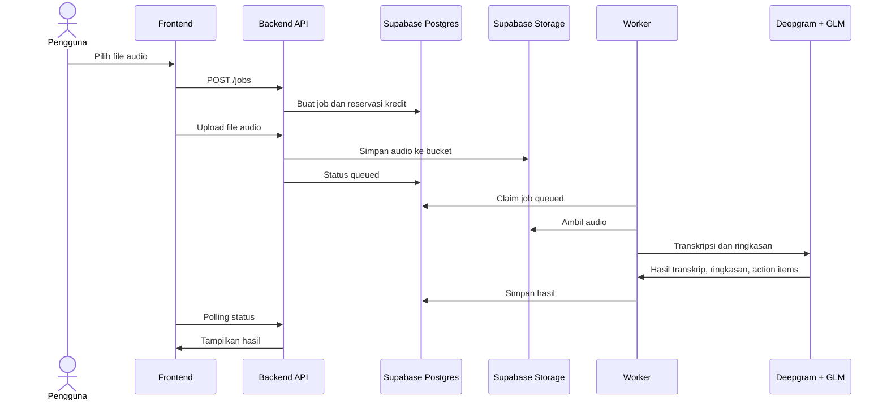

<p align="center">
  
</p>

<p align="center">
  <strong>Transkrip Rapat</strong> |
  <strong>Ringkasan AI</strong> |
  <strong>Daftar Tugas</strong> |
  <strong>Kolaborasi Tim</strong>
</p>

<p align="center">
  <a href="#tentang-taskit">Tentang</a> .
  <a href="#fitur-utama">Fitur</a> .
  <a href="#alur-kerja">Alur Kerja</a> .
  <a href="#kepatuhan-dan-tanggung-jawab-penggunaan">Kepatuhan</a> .
  <a href="#penerapan">Penerapan</a> .
  <a href="#keamanan">Keamanan</a>
</p>

---

## Tentang TASKIT

TASKIT adalah aplikasi internal untuk membantu tim mengubah rekaman rapat menjadi transkrip, ringkasan, dan daftar tindak lanjut yang lebih mudah dikelola. Aplikasi ini dibuat untuk kebutuhan kerja tim: mencatat keputusan, menandai pemilik tugas, mencari isi rapat lama, dan menjaga konteks agar tidak hilang setelah rapat selesai.

TASKIT bukan pengganti notulen resmi, penasihat hukum, atau alat pengambilan keputusan otomatis. Hasil AI harus tetap ditinjau oleh manusia, terutama untuk keputusan yang berdampak pada kontrak, keuangan, ketenagakerjaan, kesehatan, hukum, atau data pribadi.

---

## Fitur Utama

- **Transkripsi audio** dengan Deepgram, termasuk pemisahan pembicara.
- **Ringkasan rapat** dalam Bahasa Indonesia menggunakan GLM/Zhipu AI.
- **Ekstraksi action items**: tugas, penanggung jawab, tenggat, dan tingkat keyakinan.
- **Manajemen tugas** untuk admin dan anggota tim.
- **Pencarian teks penuh** di hasil transkrip.
- **Pemutar audio** dengan visualisasi waveform.
- **Dashboard tim** untuk riwayat, kredit, dan penggunaan.
- **PWA mobile-first** agar nyaman dipakai dari desktop maupun ponsel.

---

## Arsitektur



### Komponen

| Bagian | Teknologi |
|---|---|
| Frontend | React, Vite, Tailwind CSS, Framer Motion |
| Backend API | Hono, TypeScript |
| Worker | TypeScript, proses terpisah di Fly.io |
| Database | Supabase Postgres, Drizzle ORM |
| Storage Audio | Supabase Storage, S3-compatible |
| Transkripsi | Deepgram |
| Ringkasan AI | GLM / Zhipu AI |
| Auth | Session cookie |
| Queue | Polling database, tanpa Redis/message broker |

---

## Alur Kerja



Catatan penting: file audio tetap disimpan di Supabase Storage. Dalam konfigurasi produksi saat ini, browser mengirim file ke backend terlebih dahulu, lalu backend meneruskan file ke Supabase Storage. Jalur ini dipilih agar upload tidak bergantung pada CORS direct upload Supabase.

---

## Kepatuhan dan Tanggung Jawab Penggunaan

TASKIT berpotensi memproses data pribadi, suara, isi percakapan, nama, jabatan, tugas, keputusan rapat, dan informasi internal perusahaan. Karena itu, penggunaan aplikasi harus memperhatikan hukum dan etika yang berlaku di Indonesia, terutama:

- **UU No. 27 Tahun 2022 tentang Pelindungan Data Pribadi (UU PDP)**.
- **UU ITE dan perubahannya**, terutama terkait penggunaan sistem elektronik dan distribusi informasi elektronik.
- **PP No. 71 Tahun 2019 tentang Penyelenggaraan Sistem dan Transaksi Elektronik (PSTE)**.
- Kebijakan internal perusahaan terkait kerahasiaan, arsip, akses data, dan retensi dokumen.

Panduan praktis penggunaan:

- Rekam rapat hanya jika peserta sudah diberi tahu dengan jelas.
- Untuk rapat yang memuat data pribadi atau informasi rahasia, pastikan ada dasar pemrosesan yang sah, misalnya persetujuan, kepentingan kontraktual, kewajiban hukum, atau kepentingan sah organisasi.
- Jangan upload percakapan pribadi, data pelanggan, data kesehatan, data anak, data biometrik, rahasia dagang, atau dokumen sensitif tanpa izin dan kebutuhan yang jelas.
- Batasi akses hasil transkrip hanya untuk orang yang memang perlu tahu.
- Tinjau hasil AI sebelum dipakai sebagai keputusan resmi.
- Hapus data yang tidak lagi diperlukan sesuai kebijakan retensi.
- Jika ada permintaan koreksi, penghapusan, atau akses data dari subjek data, tangani sesuai prosedur organisasi dan UU PDP.

Dokumen ini bukan nasihat hukum. Untuk penggunaan produksi yang memproses data pelanggan, data karyawan, atau data sensitif, lakukan penilaian internal bersama pihak legal/compliance.

---

## Privasi Data

Data utama yang diproses:

- Akun pengguna: username, display name, status admin, dan session.
- File audio rapat yang diupload.
- Metadata job: nama file, ukuran, durasi, bahasa, status pemrosesan.
- Hasil transkrip, ringkasan, action items, dan label pembicara.
- Cache operasional seperti status job, statistik pengguna, rate limit login, dan heartbeat worker.

Lokasi penyimpanan:

- **Supabase Postgres** untuk akun, metadata, transkrip, ringkasan, action items, session, dan cache.
- **Supabase Storage** untuk file audio.
- **Deepgram** menerima audio untuk transkripsi.
- **GLM/Zhipu AI** menerima teks/transkrip untuk pembuatan ringkasan dan action items.

Rekomendasi produksi:

- Gunakan origin CORS yang spesifik, bukan wildcard.
- Gunakan secret manager Fly.io untuk kredensial.
- Terapkan kebijakan retensi file audio dan hasil transkrip.
- Hindari menaruh API key di frontend.
- Batasi akun admin.
- Audit akses ke data rapat penting.

---

## Menjalankan Lokal

### Prasyarat

- Node.js 20 atau lebih baru.
- Project Supabase dengan Postgres dan Storage.
- API key Deepgram.
- API key GLM/Zhipu AI.
- Kredensial S3-compatible dari Supabase Storage.

### Instalasi

```bash
cp .env.example backend/.env
cp .env.example frontend/.env

npm --prefix backend install
npm --prefix frontend install

npm --prefix backend run db:migrate
npm --prefix backend run db:seed
```

### Development

```bash
npm --prefix backend run dev
npm --prefix backend run dev:worker
npm --prefix frontend run dev
```

Worker membutuhkan `STORAGE_PROVIDER=s3`. Jika S3/Supabase Storage belum dikonfigurasi, API masih bisa berjalan, tetapi alur transkripsi penuh tidak akan berjalan normal.

---

## Penerapan

Backend berjalan di Fly.io dengan dua process group:

- `app`: API server.
- `worker`: pemroses job transkripsi.

Deploy dari folder `backend`:

```bash
fly deploy --config fly.toml --app taskit-contrivent
```

Release command akan menjalankan migrasi dan seed:

```text
node dist/db/migrate.js && node dist/db/seed.js
```

Variabel penting:

```text
DATABASE_URL
STORAGE_PROVIDER=s3
S3_ENDPOINT
S3_REGION
S3_BUCKET
S3_ACCESS_KEY_ID
S3_SECRET_ACCESS_KEY
S3_FORCE_PATH_STYLE=false
DEEPGRAM_API_KEY
GLM_API_KEY
GLM_BASE_URL
GLM_MODEL
ALLOWED_ORIGINS
MAX_UPLOAD_MB
BROWSER_DIRECT_UPLOAD=false
DEFAULT_ADMIN_USERNAME
DEFAULT_ADMIN_PASSWORD
```

Untuk frontend Vercel, biarkan API memakai same-origin rewrites (`/auth`, `/jobs`,
`/upload`, dst.) agar cookie session tetap first-party:

```text
# Jangan set VITE_API_URL di production Vercel.
VITE_MAX_UPLOAD_MB=250
```

---

## Keamanan

Prinsip dasar:

- Jangan commit `.env`, API key, access token, atau kredensial S3.
- Gunakan password admin yang kuat.
- Batasi `ALLOW_PUBLIC_SIGNUP` sesuai kebutuhan.
- Pastikan `ALLOWED_ORIGINS` hanya berisi domain yang sah.
- Gunakan HTTPS di production.
- Monitor log upload, login, dan worker failure.
- Rotasi secret jika ada indikasi bocor.

Jika menemukan celah keamanan, ikuti panduan di [SECURITY.md](SECURITY.md).

---

## Batasan

- Hasil transkripsi dan ringkasan AI bisa salah, tidak lengkap, atau salah memahami konteks.
- Speaker diarization tidak selalu akurat.
- Action items harus ditinjau ulang oleh pemilik rapat.
- Audio dengan noise tinggi, banyak pembicara, atau bahasa campuran dapat menurunkan kualitas hasil.
- Keputusan resmi tetap harus berdasarkan verifikasi manusia.

---

## Lisensi

Hak cipta 2026 Contrivention.

Lihat [LICENSE](LICENSE) untuk ketentuan lisensi. Jika aplikasi ini digunakan secara internal atau komersial, pastikan penggunaan data, rekaman, dan hasil transkrip tetap mengikuti kebijakan organisasi serta peraturan yang berlaku di Indonesia.
