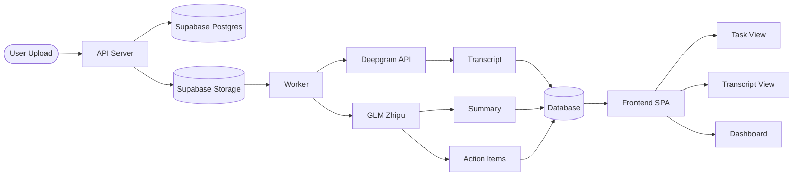
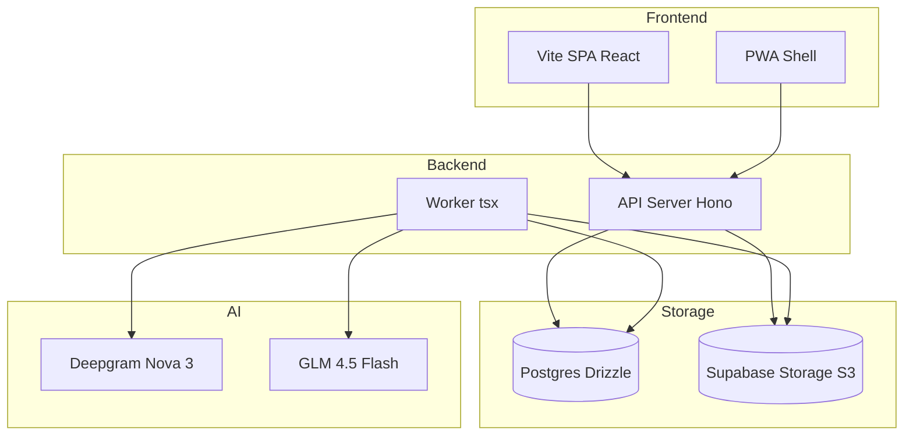
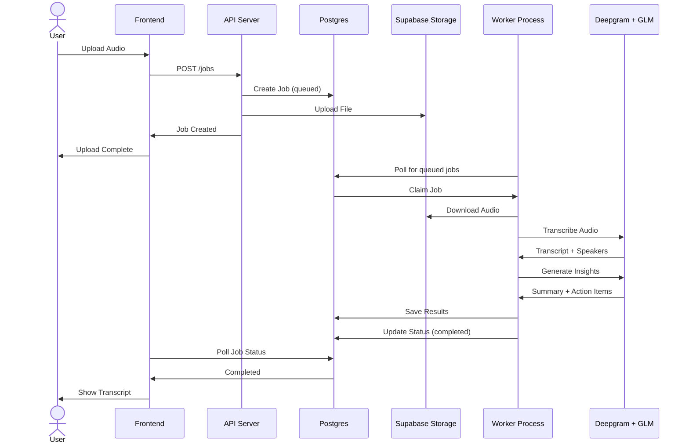
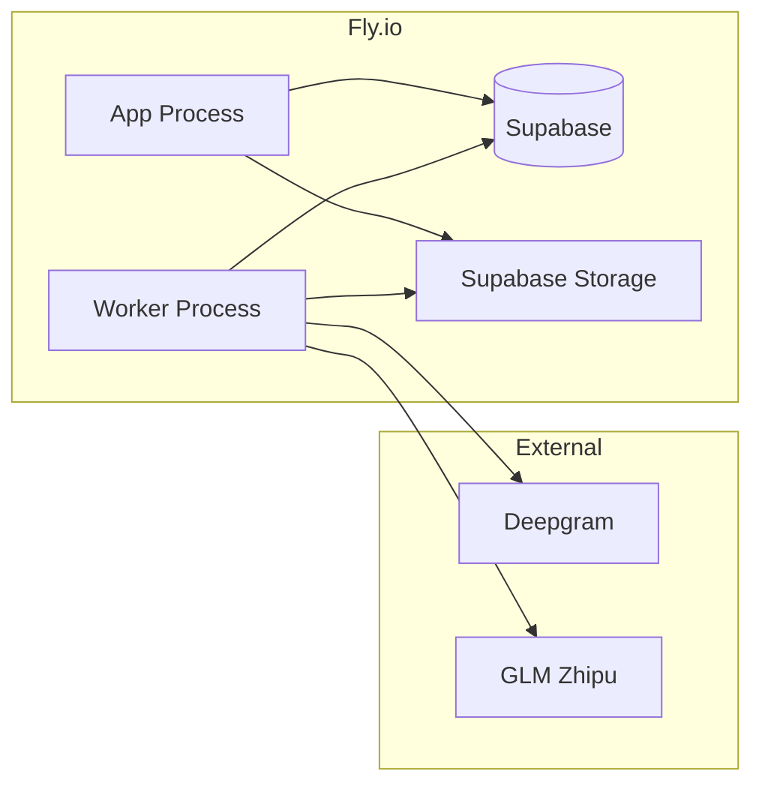

<p align="center">
  
</p>

<p align="center">
  <strong>Audio to Action Items</strong> |
  <strong>AI Transcript and Summary</strong> |
  <strong>Task Assignment</strong> |
  <strong>Team Collaboration</strong>
</p>

<p align="center">
  <a href="#features">Features</a> .
  <a href="#architecture">Architecture</a> .
  <a href="#getting-started">Getting Started</a> .
  <a href="#deploy">Deploy</a> .
  <a href="https://github.com/anomalyco/opencode/issues">Report Bug</a>
</p>

---

TASKIT is a meeting intelligence platform built for internal teams at Piranusa. Upload audio recordings and receive accurate transcripts, AI generated summaries, and structured action items assigned to the right people. Every meeting becomes a source of truth for the team.

---

## Features

- **AI Transcription** powered by Deepgram Nova 3 with speaker diarization
- **Smart Summaries** extracted by GLM (Zhipu AI) in Bahasa Indonesia
- **Action Item Extraction** automatic task detection with owner assignment and confidence scoring
- **Task Playground** admin interface to manually create and assign tasks
- **Audio Playback** real time waveform visualization with speed control and keyboard shortcuts
- **Full Text Search** search across all transcripts with inline snippet preview
- **Team Dashboard** usage analytics, user management, and credit tracking
- **Mobile First** responsive PWA with floating navigation

---

## Architecture



### Service Layout



### Data Flow



---

## Getting Started

### Prerequisites

- Node.js 20+
- Supabase project (Postgres + Storage)
- Deepgram API key
- GLM API key (Zhipu AI)

### Installation

```bash
git clone <repo>
cd taskit

cp .env.example backend/.env
# edit backend/.env with your credentials

cp .env.example frontend/.env
# edit frontend/.env with your VITE_ prefix vars

npm --prefix backend install
npm --prefix frontend install

npm --prefix backend run db:migrate
npm --prefix backend run db:seed
```

### Development

```bash
# Terminal 1 - API Server
npm --prefix backend run dev

# Terminal 2 - Worker (requires STORAGE_PROVIDER=s3)
npm --prefix backend run dev:worker

# Terminal 3 - Frontend
npm --prefix frontend run dev
```

---

## Deploy

TASKIT deploys on Fly.io as two process groups:



```bash
fly deploy --ha=false
```

The release command runs migrations and seed automatically:

```
release_command = "node dist/db/migrate.js && node dist/db/seed.js"
```

---

## Tech Stack

| Layer | Technology |
|---|---|
| Backend | Hono, TypeScript, Drizzle ORM |
| Frontend | React, Vite, Tailwind CSS, Framer Motion |
| Database | Supabase Postgres (transaction pooler) |
| Storage | Supabase Storage (S3 compatible) |
| Transcription | Deepgram Nova 3 |
| Summary | GLM 4.5 Flash (Zhipu AI) |
| Task Queue | DB polled (no message broker) |
| Auth | Session cookies |

---

## Environment Variables

Key variables documented in `.env.example`. Critical ones:

```
DEEPGRAM_API_KEY
GLM_API_KEY
GLM_BASE_URL
DATABASE_URL
S3_ENDPOINT
S3_ACCESS_KEY_ID
S3_SECRET_ACCESS_KEY
ALLOW_PUBLIC_SIGNUP
```

---

## License

Copyright 2026 Contrivention. All rights reserved.

Built with passion by the Piranusa team, Indonesia.
